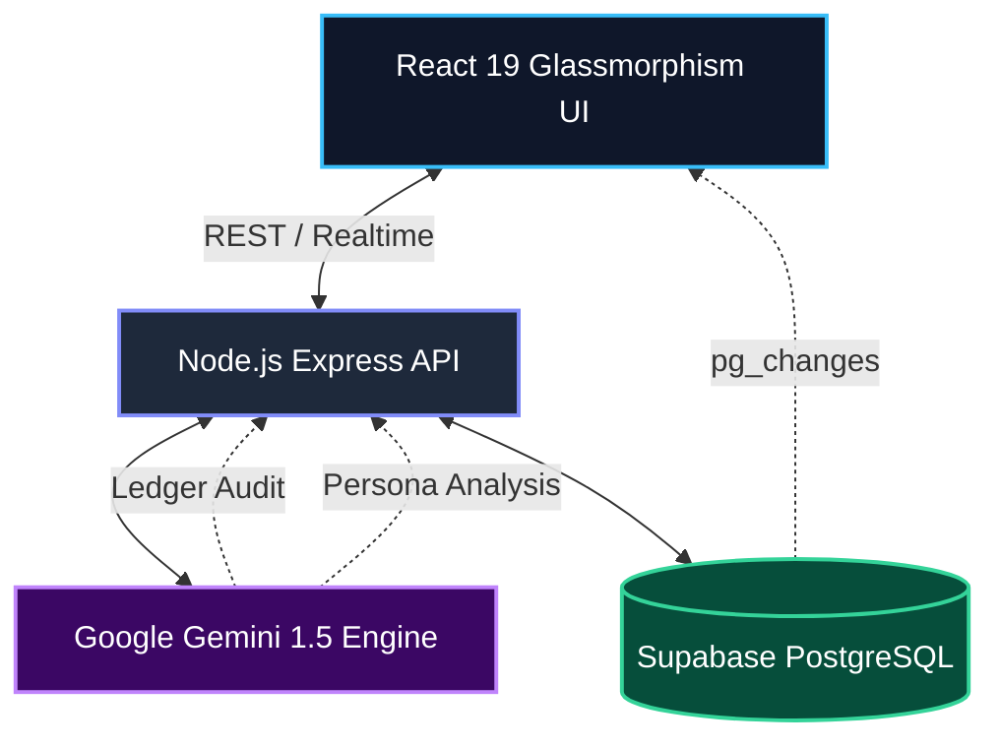

<div align="center">

# 🔮 FINSIM AI+
**Next-Generation Financial Intelligence & Behavioral Analytics**

[](https://reactjs.org/)
[](https://vitejs.dev/)
[](https://tailwindcss.com/)
[](https://supabase.com/)
[](https://deepmind.google/technologies/gemini/)

*Stop tracking the past. Start predicting the future.*

</div>

---

## 🚀 The FinTech Evolution

FINSIM AI+ isn't just a budget tracker; it's a proactive financial strategist. By combining a **Premium Glassmorphism UI** with deep **Gemini AI Behavioral Analytics**, FINSIM learns how you spend, warns you *before* you make a mistake, and audits your ledger like a Wall Street professional.

### ✨ Core Innovations
*   🧬 **Financial DNA Profiling:** AI analyzes your transaction history to determine your psychological spending persona (e.g., *Weekend Warrior*, *Prudent Saver*).
*   🕵️‍♂️ **Professional Ledger Audit:** Scans millions of data points to detect "Ghost Subscriptions" and calculate your absolute Cash-Flow Integrity.
*   🛑 **Pre-Spend Velocity Tracking:** Real-time visual tracking of your daily spending trajectory against your monthly limits.
*   💬 **Hybrid AI Strategist:** Chat with your data using Google Gemini (with seamless local Ollama fallback for total privacy).

---

## 📸 Platform Demo

Here is a glimpse of the FINSIM AI+ intelligence engine in action:

<table>
  <tr>
    <td align="center"><b>The Financial Pulse (Dashboard)</b></td>
    <td align="center"><b>Deep Behavioral Insights</b></td>
  </tr>
  <tr>
    <td></td>
    <td></td>
  </tr>
</table>

> *"At your current savings rate, you will reach your Emergency Fund goal in 4 months. Consider reducing 'Entertainment' spend to accelerate by 22 days." — **FINSIM AI***

---

## 🧠 System Architecture

FINSIM AI+ operates on a robust, real-time 4-layer architecture:



---

## 🛠️ Tech Stack

*   **Frontend:** React 19, Vite, Tailwind CSS 4 (Glassmorphism theme), Zustand, Recharts, Lucide Icons.
*   **Backend:** Node.js, Express.js.
*   **Database:** Supabase (PostgreSQL) with Real-time WebSockets.
*   **AI Engine:** Google Generative AI (Gemini 1.5 Flash) + Local Ollama Support.

---

## ⚡ Quick Start Guide

Want to run the FINSIM Intelligence Engine locally? Follow these steps:

### 1. Clone & Install
```bash
git clone https://github.com/yourusername/finsim_ai_my.git
cd finsim_ai_my

# Install Backend dependencies
cd backend && npm install

# Install Frontend dependencies
cd ../frontend && npm install
```

### 2. Environment Configuration
Create a `.env` file in the **backend** folder:
```env
PORT=5000
GEMINI_API_KEY=your_gemini_api_key
SUPABASE_URL=your_supabase_project_url
SUPABASE_KEY=your_supabase_anon_key
```

Create a `.env` file in the **frontend** folder:
```env
VITE_API_URL=http://localhost:5000
VITE_SUPABASE_URL=your_supabase_project_url
VITE_SUPABASE_ANON_KEY=your_supabase_anon_key
```

### 3. Initialize the Database
Run the following SQL in your Supabase project's SQL Editor to create the necessary intelligence tables:
<details>
<summary>Click to view SQL Script</summary>

```sql
CREATE TABLE IF NOT EXISTS transactions (
  id SERIAL PRIMARY KEY,
  amount DECIMAL(10,2) NOT NULL,
  merchant TEXT NOT NULL,
  category TEXT,
  date TIMESTAMP DEFAULT NOW(),
  type TEXT DEFAULT 'debit',
  source TEXT DEFAULT 'demo_sms',
  confidence NUMERIC(3,2) DEFAULT 1.0,
  created_at TIMESTAMP DEFAULT NOW()
);

CREATE TABLE IF NOT EXISTS budgets (
  id SERIAL PRIMARY KEY,
  category TEXT UNIQUE NOT NULL,
  limit_amount DECIMAL(10,2) NOT NULL,
  spent DECIMAL(10,2) DEFAULT 0,
  month TEXT,
  created_at TIMESTAMP DEFAULT NOW()
);

CREATE TABLE IF NOT EXISTS ai_insights (
  id SERIAL PRIMARY KEY,
  type TEXT,
  message TEXT,
  risk_level TEXT,
  created_at TIMESTAMP DEFAULT NOW()
);

CREATE TABLE IF NOT EXISTS user_behavior (
  id SERIAL PRIMARY KEY,
  personality TEXT,
  pattern TEXT,
  updated_at TIMESTAMP DEFAULT NOW()
);
```
</details>

### 4. Ignite the Engines
Open two terminals:

**Terminal 1 (Backend):**
```bash
cd backend
npm start
```

**Terminal 2 (Frontend):**
```bash
cd frontend
npm run dev
```

Navigate to `http://localhost:5173` and click **"Inject Demo Log"** to watch the AI immediately analyze synthetic financial data.

---
<div align="center">
  <i>Built to redefine personal finance.</i>
</div>
