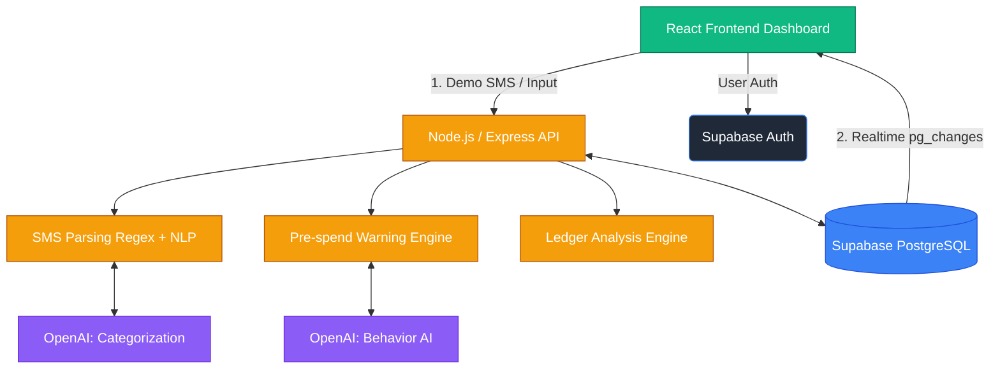

# FINSIM AI+ — Hackathon Implementation Plan

## Overview
This document outlines the complete architectural roadmap, system design, and database schemas for **FINSIM AI+**. Based on your updated requirements, the architecture has been migrated from Firebase to **Supabase**, and a robust **Ledger Analysis** feature has been integrated.

## User Review Required
> [!IMPORTANT]
> Please review the interactive architecture diagram below and the newly added Ledger Analysis module. Let me know if the Supabase schema and PostgreSQL implementation details align with your expectations.

## 1. System Design
The architecture follows a 4-layer pipeline: **Input → Process → AI Core → Output**. The backend is a stateless Node.js/Express API that orchestrates between Supabase and OpenAI. Supabase handles Auth, provides a robust PostgreSQL Database, and pushes real-time updates to the React frontend via PostgREST Realtime pub/sub.

### Interactive Architecture Diagram

*(Disclaimer: Interactive links work in most modern markdown viewers. Click a module to jump directly to its specification section.)*

---

## 2. Database Design (Supabase PostgreSQL Schema)
Replacing Firebase with Supabase gives us the power of a true relational database (PostgreSQL) paired with Row Level Security (RLS).

- **`users`**
  - `id` (uuid, references `auth.users`)
  - `name`, `age`, `income`, `profession`
  - `monthly_budgets` (JSONB): e.g., `{ "food": 5000, "transport": 2000 }`
  - `created_at` (timestamp)
- **`transactions`**
  - `id` (uuid)
  - `user_id` (uuid, references `users.id`)
  - `amount` (numeric), `merchant` (text), `category` (text)
  - `raw_sms` (text), `parsed_at` (timestamp), `t_date` (timestamp)
  - `type` (text): `'credit'` or `'debit'`
  - `is_impulse` (boolean), `confidence` (numeric)
- **`budget_status`**
  - `id` (uuid)
  - `user_id` (uuid), `month` (varchar: 'YYYY-MM')
  - `spent` (JSONB)
  - `warnings_sent` (text[])
- **`alerts`**
  - `id` (uuid)
  - `user_id` (uuid)
  - `type` (text): "pre-spend" | "overspent" | "insight"
  - `message`, `category`, `severity` (int 1-3)
  - `acknowledged` (boolean)
- **`ledger_analysis` (NEW)**
  - `id` (uuid)
  - `user_id` (uuid)
  - `reconciliation_period` (varchar)
  - `inflow_total` (numeric), `outflow_total` (numeric)
  - `detected_anomalies` (JSONB)
  - `financial_health_score` (numeric)
  - `generated_at` (timestamp)

---

## 3. Backend Design (Node.js/Express)
The API backend operates with the Supabase client:
```http
POST   /api/auth/register          → Supabase Auth signup
POST   /api/sms/parse              → parse raw SMS → Supabase transaction DB insertion
GET    /api/transactions           → paginated history
POST   /api/budget/set             → update monthly budgets
GET    /api/budget/status          → current month spent vs limits
POST   /api/ledger/analyze         → trigger AI Ledger Analysis check
POST   /api/ai/analyze             → trigger full AI behavior analysis
GET    /api/dashboard/summary      → aggregate metric data for recharts
```

**Supabase Real-time Integration:** Instead of WebSocket polling, the React front end uses Supabase's `postgres_changes` listener. Supabase delivers Postgres write validations to the client in ~50-100ms.

---

## 4. SMS Parsing Logic
The dual-pass pipeline prioritizes raw speed, utilizing standard regular expressions and reserving GPT-4 for failures.
```javascript
// REGEX PATTERNS (covers major Indian Banks e.g. HDFC, ICICI, SBI)
const patterns = {
  amount:   /(?:rs\.?|inr|₹)\s?([0-9,]+(?:\.[0-9]{2})?)/i,
  merchant: /(?:at|to|merchant[:\s]+|for)\s+([A-Z0-9& ]+?)(?:\s+on|\s+ref|\.|$)/i,
  date:     /(\d{1,2}[-\/]\w{2,3}[-\/]\d{2,4})/i,
  type:     /(debited|spent|withdrawn|paid)/i,
};
```

---

## 5. Ledger Analysis Feature (NEW)
> [!TIP]
> This new feature mimics professional audit mechanisms adapted for personal use, which adds massive credibility for hackathon judges!

**Core Features of the Ledger Engine:**
1. **Double-Entry Validation Simulation:** Maps virtual accounts (e.g., Main Bank Account ↔ Spending Categories) automatically to verify consistency.
2. **Subscription & Ghost Spend Detection:** Scans historical intervals to highlight recurring payments, especially those the user didn't categorize as recurring (e.g., hidden INR 899 "Premium" app charges).
3. **Cash-Flow Integrity:** Reconciles the net inflow (Credit Total) minus overall expenses (Debit Total) to verify structural balance.
4. **AI Output:** Compiles a succinct `financial_health_score` and `detected_anomalies` JSON returned directly to the Insights Dashboard tab.

---

## 6. AI Decision Engine
System instructions for the `gpt-4o-mini` behavior engine. 
```javascript
const SYSTEM_PROMPT = `You are FINSIM, an intelligent personal finance assistant for Indian users. Analyze spending patterns to determine personality types and give sharp, actionable advice in 2-3 sentences. Be direct, not preachy. Use INR (₹) for amounts.`;
```
Impulse detection calculates "Spike metrics" including Weekend timestamps, late-night spending hours (10PM - 4AM), and rapid identical vendor charges.

---

## 7. Pre-Spend Warning Algorithm ⭐
This hybrid system triggers during the React `addTransaction()` stage to predict failure before it materializes.
- **TIER 1 (Hard Rule - Instantaneous):** If the new spend strictly > 100% of the category budget, block & trigger a **Severity 3 Red Modal**.
- **TIER 2 (Calculated Trajectory):** Predicts month-end total based on run-rate. If it exceeds 100%, trigger a **Severity 2 Yellow Toast**.
- **TIER 3 (AI Enrichment - Delayed 300ms):** While Tier 1/2 load visually, async-request a targeted empathetic insight to append to the existing warning.

---

## 8. Frontend (React) Component Structure
- **State:** Zustand (Slim, no boilerplate payload overhead).
- **Styling:** Vanilla CSS + utility frameworks or purely customized to create a very dark, premium UI with smooth gradients.
- **Charting:** Recharts library using generic `<PieChart>` and `<AreaChart>`.
- **Live Sync Engine:**
  ```javascript
  supabase.channel('custom-insert-channel')
    .on('postgres_changes', { event: 'INSERT', schema: 'public', table: 'transactions' },
    (payload) => handleNewTransactionUpdates(payload))
    .subscribe();
  ```

---

## 9. Hackathon Roadmap (Execution Timeline)
- **Phase 1 (Hours 1–6):** Supabase configuration (Auth/PostgreSQL setups), React scaffolding + Zustand logic, basic Dashboard.
- **Phase 2 (Hours 7–14):** Node.js logic porting, SMS regex definitions. Build the new **Ledger Analysis engine algorithm**.
- **Phase 3 (Hours 15–20):** Connect OpenAI pipelines. Build the **Pre-Spend Warning modal** with staggering animations. Validate Supabase pub/sub delivery.
- **Phase 4 (Hours 21–28):** Visual polishing, implement Recharts, ensure Dark Mode feels "premium" and rehearse the WOW moment pitch.

## Open Questions
- Do you have a preference regarding which UI framework is used, like React with Vite vs. Next.js? (Vite is faster for straight SPA mockups).
- Would you like to use TailwindCSS, or stick to Vanilla CSS entirely to adhere strictly to building a bespoke, premium aesthetic without Tailwind restrictions?

## Verification Plan
1. **Realtime Tests**: Pass simulated bank SMS through our frontend to see if Supabase properly invokes an event and displays an alert in under 500ms.
2. **Ledger Check**: Push synthetic transactions containing duplicate, obscure amounts to test if Ledger Engine appropriately identifies them as "Ghost Subscriptions".
